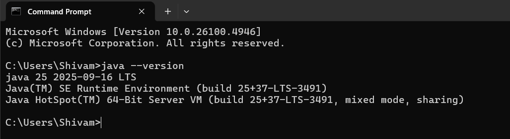
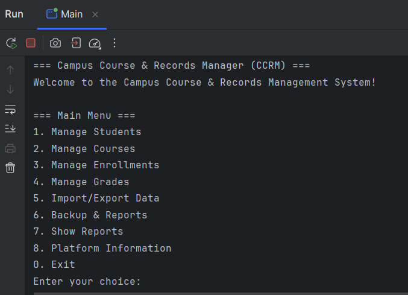
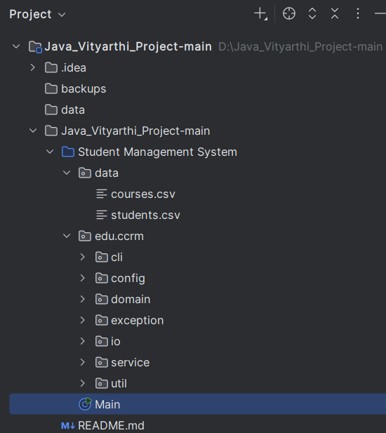
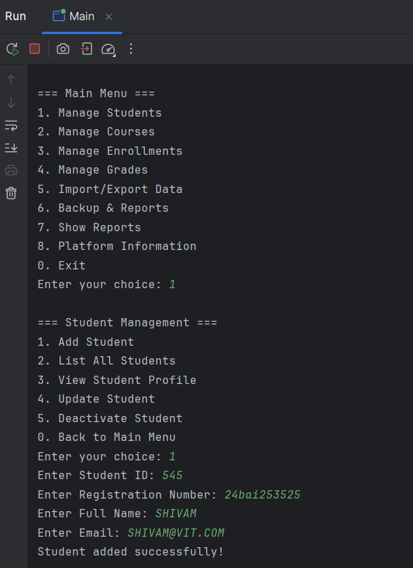

<h1 align="center">
  <br>
  Java Vityarthi Project – Student Management System
  <br>
</h1>

<p align="center">
  <a href="https://github.com/shivam24bce10755-ctrl/Java_Vityarthi_Project-main">
    
  </a>
  <a href="https://github.com/shivam24bce10755-ctrl/Java_Vityarthi_Project-main/issues">
    
  </a>
  <a href="https://github.com/shivam24bce10755-ctrl/Java_Vityarthi_Project-main/stargazers">
    
  </a>
</p>

<p align="center">
  <a href="#project-statement">Project Statement</a> •
  <a href="#key-features">Key Features</a> •
  <a href="#requirements">Requirements</a> •
  <a href="#how-to-run">Build & Run</a> •
  <a href="#project-structure">Project Structure</a> •
  <a href="#evolution-of-java">Evolution of Java</a> •
  <a href="#java-platform-comparison">Java ME vs SE vs EE</a> •
  <a href="#java-architecture">JDK, JRE, JVM</a> •
  <a href="#mapping-syllabus-implementation">Mapping Syllabus → Implementation</a> •
  <a href="#installation-on-windows">Install on Windows</a> •
  <a href="#screenshots">Screenshots</a>
</p>

---

## Project Statement

Design and implement a console-based Java application called **Campus Course & Records Manager (CCRM)** that allows an institute to:

* **Manage Students:** create, update, deactivate, view profiles, enroll/unenroll in courses.
* **Manage Courses:** create, update, list, search, assign instructors.
* **Manage Grades & Transcripts:** record marks, compute GPA, generate transcript views.
* **File Utilities:** import/export CSV-like files, archive/backup course data, recursively compute backup directory size.

This is a **Java SE project** that must use OOP principles (Encapsulation, Inheritance, Abstraction, Polymorphism), robust exception handling, modern I/O (NIO.2), Streams, Date/Time API, interfaces, abstract classes, enums, lambdas, recursion, and design patterns (Singleton & Builder).

---

## Key Features

* **Student Management** – Add/list/update/deactivate students
* **Course Management** – Add/list/update/search courses
* **Enrollment & GPA** – Enroll/unenroll students with credit limit validation
* **Grades & Transcripts** – Record marks, compute GPA, print transcripts
* **File I/O Utilities** – CSV import/export, backup using NIO.2
* **Stream API Reports** – GPA distribution, top students, enrollment stats
* **CLI Menu** – Menu-driven interface with loops, switch-case, and recursion

---

## Requirements

* **JDK:** 11 or later (recommended JDK 17)
* **OS:** Windows 10/11
* **IDE:** Eclipse or IntelliJ IDEA

---

## How to Run

```bash
# Clone this repository
git clone https://github.com/shivam24bce10755-ctrl/Java_Vityarthi_Project-main.git
cd Java_Vityarthi_Project-main/Student\ Management\ System

# Compile all Java files
javac -cp . edu/ccrm/**/*.java Main.java

# Run the program
java Main
```

---

## Project Structure

```
Java_Vityarthi_Project-main/
├── screenshots/
│   ├── file_struct.png
│   ├── java_check.png
│   ├── menu.png
│   └── menu_testing.png
├── Student Management System/
│   ├── data/
│   │   ├── courses.csv
│   │   └── students.csv
│   ├── edu/ccrm/
│   │   ├── cli/
│   │   ├── config/
│   │   ├── domain/
│   │   ├── exception/
│   │   ├── io/
│   │   ├── service/
│   │   └── util/
│   └── Main.java
└── README.md
```

---

## Evolution of Java

* **1995:** Java 1.0 – Write once, run anywhere
* **1998:** Java 2 – Collections Framework, Swing
* **2004:** Java 5 – Generics, Enums, Annotations
* **2014:** Java 8 – Streams, Lambdas, Date/Time API
* **2017:** Java 9 – Modules
* **2021:** Java 17 – Sealed classes, Pattern matching
* **2023:** Java 21 – Virtual threads, Switch pattern matching

---

## Java Platform Comparison

| Edition     | Purpose                   | Use Cases                         |
| ----------- | ------------------------- | --------------------------------- |
| **Java ME** | Mobile/embedded edition   | Feature phones, IoT               |
| **Java SE** | Core Java libraries & JVM | Desktop & CLI apps                |
| **Java EE** | Enterprise APIs           | Web services, Jakarta EE backends |

---

## Java Architecture

* **JDK** – Compiler, tools, runtime for development
* **JRE** – JVM + libraries to run applications
* **JVM** – Executes bytecode, handles memory, enables platform independence

---

## Mapping Syllabus → Implementation

| Topic                 | Where Implemented                                                 |
| --------------------- | ----------------------------------------------------------------- |
| Encapsulation         | All domain classes with private fields + getters/setters          |
| Inheritance           | `Person.java` → `Student.java`, `Instructor.java`                 |
| Abstraction           | `Person.java` (abstract), `Searchable.java` interface             |
| Polymorphism          | `getDisplayInfo()` overridden in Student/Instructor               |
| Exceptions            | `DuplicateEnrollmentException`, `MaxCreditLimitExceededException` |
| Collections & Streams | Stream API in `StudentService.java`, `ReportGenerator.java`       |
| File I/O              | `ImportExportService.java` (NIO.2 Path & Files APIs)              |
| Generics              | `Searchable<T>` interface                                         |
| Date/Time API         | `LocalDate` fields in `Enrollment.java`                           |
| Design Patterns       | Singleton (`AppConfig.java`), Builder (`Course.java`)             |

---

## Installation on Windows

1. Download JDK from [Oracle](https://www.oracle.com/java/technologies/downloads/) or [Adoptium](https://adoptium.net/)
2. Install JDK and set `JAVA_HOME`
3. Add `%JAVA_HOME%\bin` to PATH
4. Verify installation:

```bash
java -version
javac -version
```

5. Install Eclipse or IntelliJ and import the project
6. Run `Main.java`

---

## Screenshots

### 1. Java Installation Verification



### 2. Main Menu



### 3. Project File Structure



### 4. Menu Testing



<h3 align="center">Thank you for exploring this project! Contributions and feedback are welcome.</h3>
